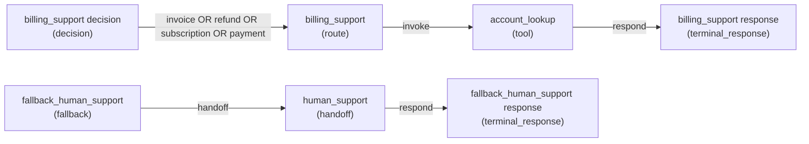

# Behaviour graph generation

Agent Lint can compile an `.agentspec.yaml` file into an internal directed behaviour graph.

```bash
pnpm agentlint graph examples/customer-support.agentspec.yaml
pnpm agentlint graph examples/customer-support.agentspec.yaml --json
pnpm agentlint graph examples/customer-support.agentspec.yaml --mermaid
pnpm agentlint graph examples/customer-support.agentspec.yaml --ascii
```

## Graph model

The graph model uses these node types:

- `route`
- `decision`
- `tool`
- `constraint`
- `handoff`
- `fallback`
- `terminal_response`

Edges are typed as:

- `conditional_transition`
- `precedence_branch`
- `escalation_path`
- `tool_invocation_path`
- `constraint_gate`
- `terminal_transition`

## Mermaid example



## Diagnostics

Graph compilation reports diagnostics for:

- invalid condition operators
- circular dependencies
- unreachable branches
- conflicting precedence definitions
- dead-end states
- unreachable nodes
- isolated routes

The graph command exits non-zero when an error-level diagnostic is found. Warning diagnostics are included in output but do not fail the command.
